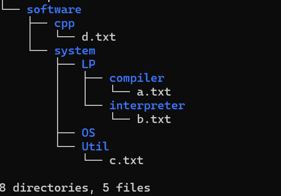

# 학습 일정

## [Week 2](https://github.com/kimguppy/SystemProgramming/tree/main/week02)

### 📌 학습 내용
- 리눅스 기본 명령어

### 📝 과제
- WSL 환경에서 파일 생성 및 이동 실습

## [Week 3](https://github.com/kimguppy/SystemProgramming/tree/main/week03)
### 📌 학습 내용
- 리눅스 기본 명령어
WSL(Windows Subsystem for Linux)에서 사용되는 경로는 Windows의 파일 시스템과 달리 리눅스 스타일 경로를 사용합니다.
하지만 Windows의 파일 시스템을 접근하려면, WSL에서의 경로는 /mnt/ 디렉토리 아래에 Windows 드라이브를 마운트하는 방식으로 설정됩니다.

1️⃣ WSL에서 Windows 드라이브 경로 접근
- C 드라이브: /mnt/c/
- D 드라이브: /mnt/d/
- E 드라이브: /mnt/e/

  ### 📝 과제
- WSL 환경에서 c프로그램 작성 및 실행

## [Week 4](https://github.com/kimguppy/SystemProgramming/tree/main/week04)

  ### 📝 과제
- WSL 환경에서 c프로그램 작성 및 실행

## [Week 5](https://github.com/kimguppy/SystemProgramming/tree/main/week05)
### 📌 학습 내용
오늘 이진수 변환 프로그램을 구현하는 과정에서 Claude AI를 활용했습니다.

  ### 📝 과제
- 사용자 입력 값 검증 (0~255 범위)
- 8비트 이진수 변환 로직
- 1의 개수를 세는 효율적인 방법
- 상위 4비트 추출 방법
  

## [Week 6](https://github.com/kimguppy/SystemProgramming/tree/main/week06)
### 📌 학습 내용 
Bash 스크립트 실습을 통한 VI 편집기 사용법 연습 및 변수 활용, 명령줄 계산기 학습

## [Week 7](https://github.com/kimguppy/SystemProgramming/tree/main/week7)
### 📌 학습 내용 
Bash 스크립트 실습을 통한 파일 복사, 컴파일 학습

# 리눅스에서 C 파일 컴파일 과정 간략 정리

1. **전처리 (Preprocessing)**  
   - `#include`, `#define` 등 매크로와 헤더파일을 처리  
   - 결과: 확장된 소스 코드 (`.i` 파일)

2. **컴파일 (Compilation)**  
   - 전처리된 코드를 어셈블리어로 변환  
   - 결과: 어셈블리 코드 (`.s` 파일)

3. **어셈블 (Assembly)**  
   - 어셈블리 코드를 기계어(객체코드)로 변환  
   - 결과: 객체 파일 (`.o` 파일)

4. **링킹 (Linking)**  
   - 여러 객체 파일과 라이브러리를 연결하여 실행 파일 생성  
   - 결과: 실행 파일 (예: `a.out`)

---

예시 명령어:  
gcc hello.c -o hello

## [Week 9](https://github.com/kimguppy/SystemProgramming/tree/main/week9)
### 📌 학습 내용 
 리눅스 시스템 프로그래밍 및 구조화된 C 프로그래밍에 대한 중간 수준 또는 고급 주제 1

## [Week 10](https://github.com/kimguppy/SystemProgramming/tree/main/week10)
### 📌 학습 내용 
 리눅스 시스템 프로그래밍 및 구조화된 C 프로그래밍에 대한 중간 수준 또는 고급 주제 2
 
### 📝 과제
- WSL 환경에서 list1.c 직접 실행
1. 파일 상태 정보 조회 (stat / lstat): 파일의 메타정보(크기, 권한, 소유자, 수정 시간 등)를 시스템 콜로 조회하는 방법
2. 디렉터리 탐색 (opendir, readdir, closedir): 디렉터리 내 파일 리스트를 읽고 처리하는 방법
3. 파일 권한 및 타입 표시 (파일 모드 비트 해석): st_mode를 해석해 파일 타입(일반파일, 디렉터리, 링크 등)과 권한 문자열(rwx)을 출력하는 방법
   

## [Week 11](https://github.com/kimguppy/SystemProgramming/tree/main/week11)
### 📌 학습 내용 
리눅스에서 링크의 개념과 생성, 활용 방법을 이해 및 실습

#심볼릭 링크 (Symbolic Link) vs 하드 링크 (Hard Link)

- **심볼릭 링크 (Soft Link)**  
  - 원본 파일의 경로를 가리키는 특수 파일  
  - 원본이 삭제되면 링크는 깨짐(broken link)  
  - 디렉터리도 링크 가능  
  - 생성: `ln -s 원본 링크`

- **하드 링크**  
  - 원본 파일과 동일한 inode를 참조하는 또 다른 이름  
  - 원본 파일이 삭제되어도 데이터는 유지됨 (링크가 모두 삭제되어야 데이터 삭제)  
  - 디렉터리에 대한 하드 링크는 일반적으로 불가능  
  - 생성: `ln 원본 링크`

## [Week 12](https://github.com/kimguppy/SystemProgramming/tree/main/week12)
### 📌 학습 내용 
fork()와 프로세스 관련 개념(프로세스 생성과 종료, 부모-자식 관계, 프로세스의 PID 관리)
# fork()와 프로세스 개념 간단 정리

- **fork()**: 부모 프로세스를 복사해 자식 프로세스를 생성합니다. 반환값으로 부모와 자식을 구분할 수 있습니다.  
- **프로세스 생성/종료**: fork()로 프로세스 생성, exit() 또는 return으로 종료합니다. 부모는 wait()로 자식 종료 상태를 확인합니다.  
- **부모-자식 관계**: 자식은 부모 PID를 알고, 부모는 자식 PID를 알 수 있으며 각각 독립적으로 실행됩니다.  
- **PID 관리**: PID는 프로세스 고유 번호이며, getpid()로 자신의 PID, getppid()로 부모 PID를 확인할 수 있습니다.

💡 fork()로 새 프로세스를 만들고, 부모는 wait()로 자식 종료를 처리합니다.

## 💾[리포트]
